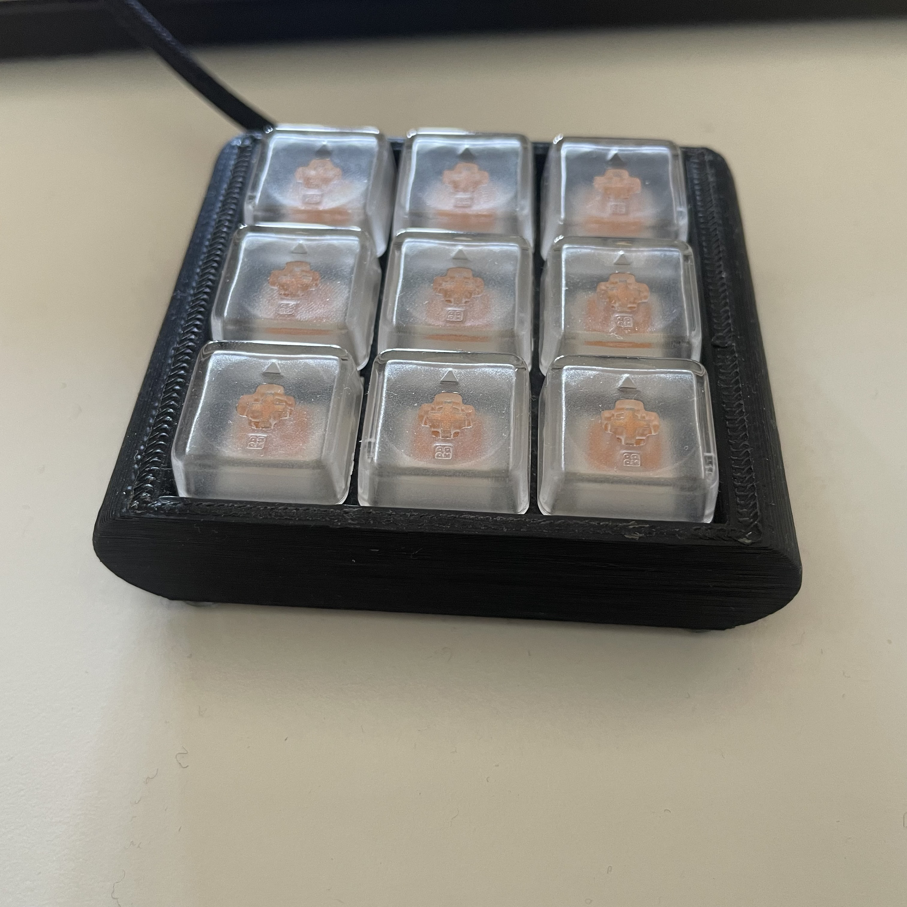

# helldiver-kbd firmware

_helldiver-kbd is a 9key macro-keyboard built for the popular game Helldivers 2._

*why?*

- democracy

*how?*

- The 'default' keymap supports [QMK](https://github.com/qmk/qmk_firmware).
- The vial keymap support [VIAL](https://github.com/vial-kb/vial-qmk) and there is a companion app with [Strataman](https://github.com/timonviola/strataman).

1. Set up your qmk build env.
1. Add this repo under keyboards/helldiver
1. To flash the firmware run:

`qmk flash -kb helldiver -km default`

To customize the keymap, edit `keymaps/default/keymap.c`:
  - change the LAYOUT to edit your keymap (use keycodes from custom_keycodes)

## Flashing the firmware
- Probably you need to change the diode direction in rules.mk
- Make sure you use vial-qmk if you want to have vial-gui/strataman support.
- Pro-micro support (ATmega32u4) is default, you can easily use other mcu-s. (Especially with VIAL, it will be easier to fit the firmware into memory using e.g. blackpill.)

## building your own
Personally I have equal amount of fun working on this project (or evenmore) as playing the game. I encourage you to build your own keyboard :)

# todo
- [x] via or some UI way of editing keymap so it's more approachable
- [x] verify generated keymaps
  - some keymaps are missing, some are incorrect.
- [ ] add hardware repo for a 3x3 macropad
